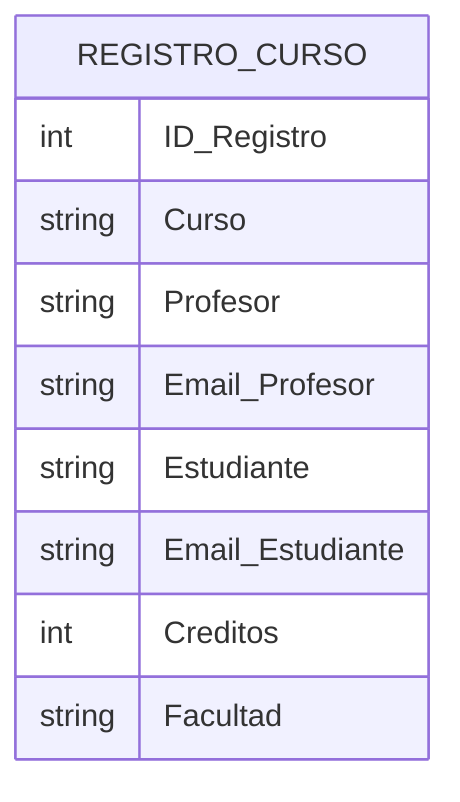
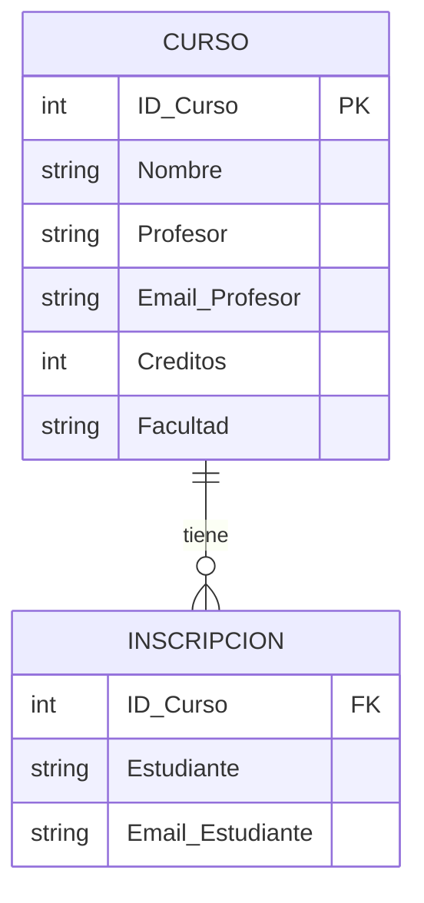
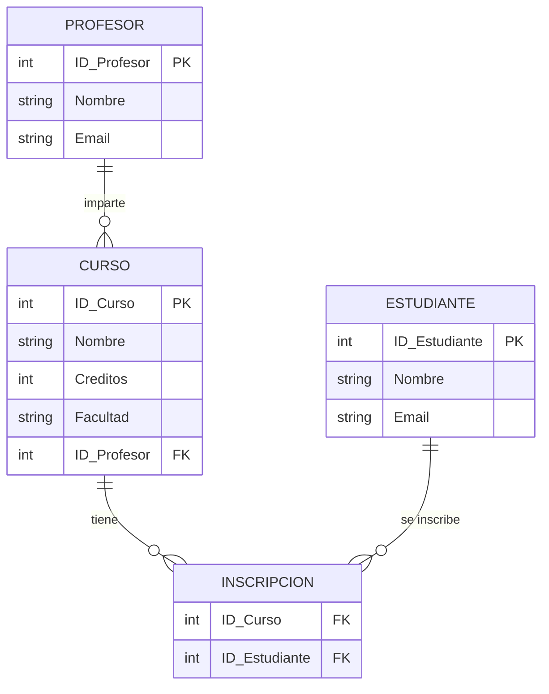

# Normalización de Base de Datos hasta la Tercera Forma Normal (3NF)

## Objetivo
Aplicar los principios de normalización de bases de datos relacionales hasta la **Tercera Forma Normal (3NF)**, estructurando la información de manera que los datos sean consistentes, no redundantes y fáciles de mantener.

---

## Contexto
Una universidad necesita registrar información sobre los cursos que imparte, los profesores que los enseñan y los estudiantes que los inscriben.  
Actualmente, los datos se guardan en una única tabla llamada `Registro_Cursos` con la siguiente estructura:

| ID_Registro | Curso             | Profesor      | Email_Profesor      | Estudiantes            | Emails_Estudiantes                        | Créditos | Facultad    |
|--------------|------------------|----------------|---------------------|------------------------|-------------------------------------------|-----------|--------------|
| 1            | Bases de Datos    | Ana Torres     | ana@uni.edu         | Luis, María, Jorge     | luis@uni.edu, maria@uni.edu, jorge@uni.edu | 4         | Ingeniería   |
| 2            | Programación Web  | Carlos López   | carlos@uni.edu      | Pedro, Ana, Lucía      | pedro@uni.edu, ana@uni.edu, lucia@uni.edu  | 5         | Ingeniería   |

---

## Análisis Inicial (0NF)
La tabla no cumple con las condiciones de una base de datos normalizada debido a los siguientes problemas:

- **Datos repetidos y redundantes:** La información del profesor y la facultad se repite en cada registro.  
- **Campos multivaluados:** Los campos `Estudiantes` y `Emails_Estudiantes` contienen múltiples valores en una sola celda.  
- **Difícil mantenimiento:** Si cambia el correo de un estudiante o profesor, debe actualizarse en varias filas.  
- **Dependencias no claras:** Los estudiantes dependen del curso, pero también pueden estar inscritos en otros cursos, lo cual no está representado adecuadamente.

---

## Primera Forma Normal (1NF)

### Reglas
Para que una tabla esté en **1NF**, debe cumplir:
1. Cada celda debe contener un solo valor (sin listas ni valores repetidos).
2. Cada fila debe ser única.
3. Todos los atributos deben ser atómicos.

### Aplicación
Descomponemos los valores multivaluados (`Estudiantes`, `Emails_Estudiantes`) en registros individuales.

#### Estructura resultante (1NF)

### Cada estudiante inscrito en un curso ahora ocupa una fila independiente.

| ID_Registro | Curso            | Profesor     | Email_Profesor                          | Estudiante | Email_Estudiante                      | Créditos | Facultad   |
| ----------- | ---------------- | ------------ | --------------------------------------- | ---------- | ------------------------------------- | -------- | ---------- |
| 1           | Bases de Datos   | Ana Torres   | [ana@uni.edu](mailto:ana@uni.edu)       | Luis       | [luis@uni.edu](mailto:luis@uni.edu)   | 4        | Ingeniería |
| 1           | Bases de Datos   | Ana Torres   | [ana@uni.edu](mailto:ana@uni.edu)       | María      | [maria@uni.edu](mailto:maria@uni.edu) | 4        | Ingeniería |
| 1           | Bases de Datos   | Ana Torres   | [ana@uni.edu](mailto:ana@uni.edu)       | Jorge      | [jorge@uni.edu](mailto:jorge@uni.edu) | 4        | Ingeniería |
| 2           | Programación Web | Carlos López | [carlos@uni.edu](mailto:carlos@uni.edu) | Pedro      | [pedro@uni.edu](mailto:pedro@uni.edu) | 5        | Ingeniería |
| 2           | Programación Web | Carlos López | [carlos@uni.edu](mailto:carlos@uni.edu) | Ana        | [ana@uni.edu](mailto:ana@uni.edu)     | 5        | Ingeniería |
| 2           | Programación Web | Carlos López | [carlos@uni.edu](mailto:carlos@uni.edu) | Lucía      | [lucia@uni.edu](mailto:lucia@uni.edu) | 5        | Ingeniería |

## Segunda Forma Normal (2NF)

### Reglas
Para que una tabla esté en **2NF**, debe cumplir:
1. Debe estar en 1NF.
2. Todos los atributos no clave deben depender de la clave completa, no solo de una parte de ella.

### Aplicación
La clave primaria actual es compuesta (`Curso`, `Estudiante`).
Sin embargo:
`Profesor`, `Email_Profesor`, `Créditos`, `Facultad` dependen solo de `Curso`, no de `Estudiante`.

### Por lo tanto, separamos la información en dos tablas:

## Tercera Forma Normal (3NF)
### Reglas

Para cumplir la 3NF:

Debe estar en 2NF.

No debe haber dependencias transitivas (ningún atributo no clave depende de otro atributo no clave).

### Aplicación

En la tabla `CURSO`, el `Profesor` y su `Email_Profesor` están relacionados entre sí.
Por lo tanto, creamos una tabla independiente para los profesores.

Estructura resultante **(3NF)**:

Diseño Final **(3NF)**:

| Tabla           | Atributos principales                                       |
| --------------- | ----------------------------------------------------------- |
| **PROFESOR**    | ID_Profesor (PK), Nombre, Email                             |
| **CURSO**       | ID_Curso (PK), Nombre, Créditos, Facultad, ID_Profesor (FK) |
| **ESTUDIANTE**  | ID_Estudiante (PK), Nombre, Email                           |
| **INSCRIPCION** | ID_Curso (FK), ID_Estudiante (FK)                           |

## Conclusión:

El modelo evolucionó desde una tabla desorganizada y redundante hasta un esquema estructurado y escalable.
A través de la normalización:

1. Se eliminaron los datos duplicados y los valores multivaluados.

2. Se separaron las dependencias funcionales y transitivas.

3. Se facilitó el mantenimiento y actualización de la información.

En el modelo final, cada entidad (`profesor`, `curso`, `estudiante`) tiene su propia tabla y las relaciones están claramente definidas, garantizando integridad referencial y coherencia de los datos.